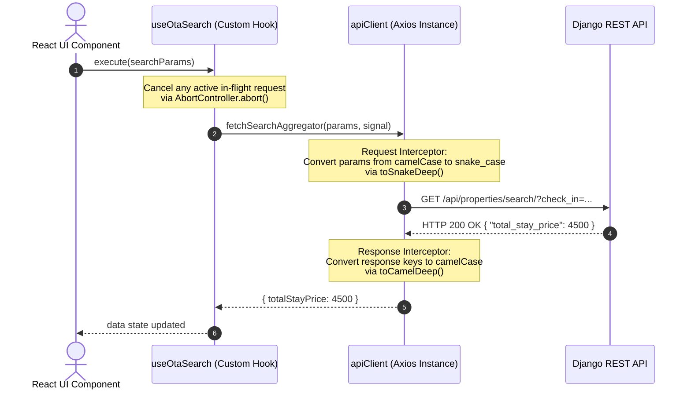

# Forensic Audit Report: State, Network, and Token Isolation (TP-AUDIT-FE2-001)

- **Task ID:** TP-AUDIT-FE2-001
- **Agent:** FE2 (Integration & Global State Specialist)
- **Date:** 2026-06-10
- **Model:** Gemini 3.5 Flash (High)
- **Scope:** 
  - [apiClient.js](file:///d:/ZIAD%20Alhalwany/TRAVILOPHILIA/TRAVELOPHILIA%20WEBSITE/_worktrees/fe2/src/services/apiClient.js)
  - [authStorage.js](file:///d:/ZIAD%20Alhalwany/TRAVILOPHILIA/TRAVELOPHILIA%20WEBSITE/_worktrees/fe2/src/services/authStorage.js)
  - [crmAuth.js](file:///d:/ZIAD%20Alhalwany/TRAVILOPHILIA/TRAVELOPHILIA%20WEBSITE/_worktrees/fe2/src/services/crmAuth.js)
  - [useOtaServices.js](file:///d:/ZIAD%20Alhalwany/TRAVILOPHILIA/TRAVELOPHILIA%20WEBSITE/_worktrees/fe2/src/hooks/useOtaServices.js)

---

## 🔍 Executive Summary

This audit assesses the resilience, correctness, and isolation of Travelophilia's frontend data fetching layer, network integration pipelines, token storage, and custom state lifecycles. 

The investigation covers:
1. **Network Resilience & PWA Compatibility:** Analyzing offline safeguards and `navigator.onLine` interceptor status.
2. **Race-Condition & Lifecycle Integrity:** Validating the `AbortController` cancellation mechanisms in custom OTA hooks.
3. **Casing Conversion Pipelines:** Tracing recursive `snake_case` $\leftrightarrow$ `camelCase` transformations.
4. **Token Isolation & Storage Safety:** Auditing the JWT token keys and fallback mechanisms for B2B Partners and CRM Staff.

---

## 📋 Forensic Checklist Findings

### 1. PWA Connection Resilience Interceptors (apiClient.js)
* **Status:** ⚠️ **Partially Implemented (No dynamic queuing)**
* **Details:** 
  * The `apiClient.js` instance does **not** dynamically monitor `navigator.onLine` in its request interceptors to queue outgoing requests during connection loss.
  * Instead, it relies on static response error handling. When a request fails due to a network disconnect (no HTTP response code), it is caught in `dispatchGlobalError` as a pure network failure:
    ```javascript
    } else if (!error.response && error.message !== "canceled") {
      _globalErrorHandler("Network error. Check your connection.", {});
    }
    ```
  * *PWA Offline Experience:* Active network status tracking is delegated to UI guards (e.g., `PartnerGuard` in `authGuard.jsx` which displays offline alerts), but the Axios instance lacks offline request buffering or automated background sync queues.

### 2. Custom Hooks Lifecycle & Race-Condition Shields (useOtaServices.js)
* **Status:**  **Fully Implemented & Resilient**
* **Details:**
  * Custom OTA hooks (like `useOtaSearch`) wrap api calls using the shared `useOtaRequest` hook, which manages the lifecycle with the help of the `createCancellableRequest` factory.
  * Each execution cancels any in-flight request by calling `.abort()` on the active `AbortController`.
  * **Component Unmount Safety:** The cleanup function of the `useEffect` hooks in `useOtaRequest` calls `abort()` and sets a `mountedRef.current` flag to `false`. This prevents memory leaks and guarantees that state transitions (`setState`) do not occur on unmounted components.
  * **Parameter Ordering Stability:** Resolves the parameter ordering issue where `AbortSignal` is automatically reordered inside `apiClient.js` service methods (e.g., `fetchSearchAggregator`) depending on the presence of `addEventListener` on the first argument.

### 3. Key Casing Conversions Traceability
* **Status:**  **Fully Implemented & Automated**
* **Details:**
  * **Outgoing Requests (Request Interceptor):** `apiClient.js` calls `toSnakeDeep(config.data)` and `toSnakeDeep(config.params)` before sending payloads to the Django backend.
  * **Incoming Responses (Response Interceptor):** Converts responses to camelCase via `toCamelDeep(response.data)` and `toCamelDeep(error.response.data)`.
  * **Special Type Safeguards:** The converter in `caseConverter.js` skips native web APIs like `FormData`, `URLSearchParams`, `Blob`, and `Date` using `shouldSkip(value)` to avoid payload corruption.

### 4. Storage Key Isolation (authStorage.js vs crmAuth.js)
* **Status:**  **Fully Isolated & Secure**
* **Details:**
  * Strict cryptographic and variable key namespace isolation exists between B2B Partner tokens and CRM Staff tokens.
  * **Storage Method Isolation:** Partners use raw `localStorage` directly, while CRM staff use a resilient, safe wrapper (`localStorage` $\rightarrow$ `sessionStorage` $\rightarrow$ in-memory `Map` fallback) to prevent cookies/storage blockages.

| User Segment | Token Purpose | Access Token Key | Refresh Token Key | Storage Fallback |
| :--- | :--- | :--- | :--- | :--- |
| **B2B Partners / Suppliers** | Extranet & Inventory Access | `travelophilia_access_token` | `travelophilia_refresh_token` | None (Direct `localStorage`) |
| **CRM Staff / Employees** | Internal CRM & Lead Management | `tp_crm_access` | `tp_crm_refresh` | `sessionStorage` $\rightarrow$ Memory `Map` |

---

## 🗺5. System Integration Flow Diagrams

### 1. Request Lifecycle & Casing Pipeline
This diagram traces how a frontend component triggers an action, converts data structures, handles concurrent requests, and normalizes responses:



### 2. Network Error Handler Pipeline
This diagram traces how API errors (such as invalid tokens or validation bugs) flow through the global, UI-decoupled handler:

```mermaid
flowchart TD
    A[Axios Error Caught] --> B{HTTP Status Code?}
    
    B -->|400 Bad Request| C[Parse Django Validation Errors]
    C --> D[Format validation dictionary to single string]
    D --> E[Dispatch to Pluggable Global Error Handler]
    
    B -->|401 Unauthorized| F{Is B2B or CRM?}
    F -->|B2B Partner / Client| G[Trigger refresh via /token/refresh/]
    G -->|Refresh OK| H[Retry original request with new access token]
    G -->|Refresh Failed| I[Clear storage & Redirect to login]
    F -->|CRM Staff / authFetch| J[Trigger refresh via /api/auth/token/refresh/]
    J -->|Refresh OK| K[Retry original request]
    J -->|Refresh Failed| L[Logout & dispatch logout event]
    
    B -->|403 Forbidden| M[Dispatch: "You do not have permission..."]
    B -->|404 Not Found| N[Dispatch: "Resource not found."]
    B -->|>=500 Server Error| O[Dispatch: "Server error. Try again later."]
    B -->|No Response / Offline| P[Dispatch: "Network error. Check connection."]
    
    E --> Q[UI Toast Notification Displayed]
    M --> Q
    N --> Q
    O --> Q
    P --> Q
```

---

## 📐 6. State Architecture Map

```
┌──────────────────────────────────────────────────────────────────┐
│                      React UI Components                         │
│   e.g., AvailabilityCalendarCard, SearchAggregator, CRMLeads     │
└────────────────────────────────┬─────────────────────────────────┘
                                 │
                    ┌────────────┴────────────┐
                    ▼                         ▼
        ┌───────────────────────┐ ┌───────────────────────┐
        │   useOtaServices.js   │ │   Custom Page State   │
        │                       │ │                       │
        │ - useOtaSearch        │ │ - Local component    │
        │ - usePropertyAvail... │ │   state (useState)    │
        │ - useBulkInventory... │ └───────────────────────┘
        │ - useWaitlistSubmit   │
        └───────────┬───────────┘
                    │
                    ▼
        ┌─────────────────────────────────────────────────────────┐
        │                    apiClient.js                         │
        │                                                         │
        │  - Axios instance (api)                                 │
        │  - createCancellableRequest (AbortController wrapper)    │
        │  - Case conversion Interceptors (toSnake / toCamel)     │
        │  - JWT Interceptor & Global Error Handler Dispatcher    │
        └───────────┬─────────────────────────┬───────────────────┘
                    │                         │
                    ▼                         ▼
        ┌───────────────────────┐ ┌───────────────────────┐
        │     authStorage.js    │ │      crmAuth.js       │
        │                       │ │                       │
        │  (B2B Partners Keys)  │ │  (CRM Staff Keys)     │
        │  - travelophilia_     │ │  - tp_crm_access      │
        │    access_token       │ │  - tp_crm_refresh     │
        │  - travelophilia_     │ │                       │
        │    refresh_token      │ │  - SafeStorage        │
        │                       │ │    Fallback Pipeline  │
        └───────────────────────┘ └───────────────────────┘
```

---

## 🔒 7. Token Refresher & Security Lifecycles

### CRM Token Refresh Pipeline (`crmAuth.js`)
CRM request authentication uses native browser `fetch` via the `authFetch` wrapper:
1. Intercepts outgoing requests to append `Authorization: Bearer <access_token>`.
2. Intercepts `401 Unauthorized` responses.
3. Automatically triggers `refreshAccessToken` using the `/api/auth/token/refresh/` endpoint.
4. Prevents duplicate refresh requests via `refreshInFlight` promise deduplication.
5. In case of refresh failure, clears tokens and dispatches a custom event `tp:crm:logout` to reset page routing.

### B2B Partner Token Refresh Pipeline (`apiClient.js`)
Partner requests use `axios`:
1. Axios request interceptor injects the token from `authStorage`.
2. Response interceptor catches `401` status codes.
3. Dedupes multiple concurrent refreshes with the `refreshInFlight` flag.
4. Requests a new token from `/api/token/refresh/` using the refresh token.
5. Retries the original request with the new access token.
6. Clears storage and redirects on failure.
